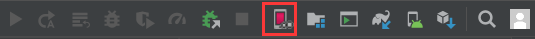
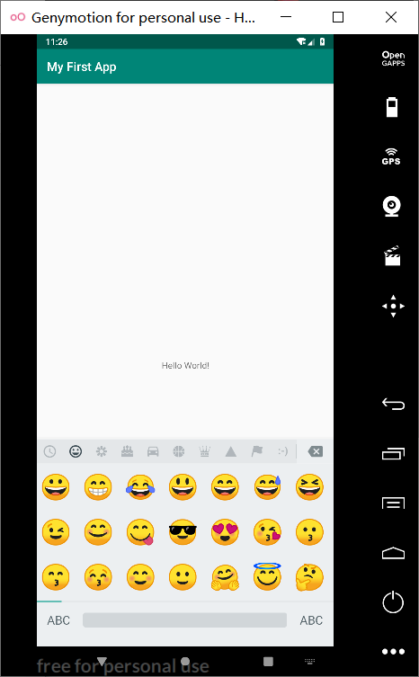
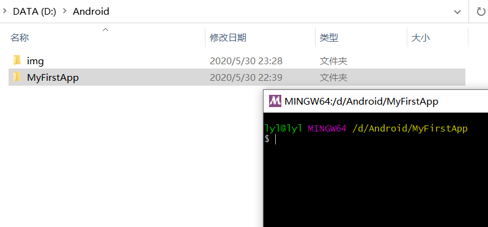

* **实验一**

## 一、开发环境搭建：

    JDK1.8
    Android Studio 3.5
    Genymotion模拟器

1.[安装 Android Studio 3.5](https://developer.android.google.cn/studio/install)

2.安装Genymotion模拟器，以及Android上安装genymotion插件使用 [详情参见](https://blog.csdn.net/qq_40223688/article/details/78997883?utm_medium=distribute.pc_relevant.none-task-blog-BlogCommendFromMachineLearnPai2-1.nonecase&depth_1-utm_source=distribute.pc_relevant.none-task-blog-BlogCommendFromMachineLearnPai2-1.nonecase)

3.遇到问题：Android Studio工具栏不显示Genmotion图标


解决办法：[参见博客(找了好久)](https://blog.csdn.net/qq_39756109/article/details/87539191?utm_medium=distribute.pc_relevant.none-task-blog-BlogCommendFromMachineLearnPai2-1.nonecase&depth_1-utm_source=distribute.pc_relevant.none-task-blog-BlogCommendFromMachineLearnPai2-1.nonecase)

解决后：



## 二、创建 第一个Android 项目

1.参见[官方文档](https://developer.android.google.cn/training/basics/firstapp/creating-project)


2.运行结果：



3.认识Android projection里文件

**app \> java \> com.example.myfirstapp \> MainActivity**

>   这是主
>   Activity。它是应用的入口点。当您构建和运行应用时，系统会启动此 [Activity](https://developer.android.google.cn/reference/android/app/Activity) 的实例并加载其布局。

**app \> res \> layout \> activity_main.xml**

>   此 XML 文件定义了 Activity
>   界面的布局。它包含一个 TextView 元素，其中具有“Hello, World!”文本

**app \> manifests \> AndroidManifest.xml**

>   [清单文件描述了应用的基本特性并定义了每个应用组件。](https://developer.android.google.cn/guide/topics/manifest/manifest-intro)

**Gradle Scripts \> build.gradle**

>   有两个使用此名称的文件：一个针对项目“Project: My FirstApp”，另一个针对应用模块“Module:app”。每个模块均有自己的 build.gradle 文件，但此项目当前仅有一个模块。您可以使用每个模块的[ build.file 控制 ](https://developer.android.google.cn/guide/topics/manifest/manifest-intro)[Gradle插件](https://developer.android.google.cn/studio/releases/gradle-plugin)编译应用的方式。要详细了解此文件，请参阅[配置编译版本](https://developer.android.google.cn/studio/build#module-level)。

## 三、使用git bash上传代码到Github
================================

1.  打开你建立的Android工程目录。右键My Fist App，选择**Git Bash Here**



1.  **Git操作**

>git init


##### 将本地仓库和GitHub的仓库关联

>git remote add origin +你自己GitHub仓库上面的地址


>git remote add origin https://github.com/lyl10/Android.git


验证是否成功

>git remote -v


.gitignore是生成Android 忽略的文件

法一：首先在刚才打开的Git Bash里面敲入命令   
vim .gitignore

配置如下：
```
*.iml
.gradle
app/build/
/local.properties
/.idea/caches
/.idea/libraries
/.idea/modules.xml
/.idea/workspace.xml
/.idea/navEditor.xml
/.idea/assetWizardSettings.xml
.DS_Store
/build
/captures
.externalNativeBuild
.cxx
```


法2：可以通过Android Studio 工具添加忽略文件。File---\>Setting---\>Version
Control---\>Ignored Files  点击右侧的小+或者小- 进行添加删除 上面的文件即可。


##### 将文件夹里的所有文件添加，并提交(commit)到本地仓库
```
git add .

git commit -m "My First App"

git push -u origin master
```