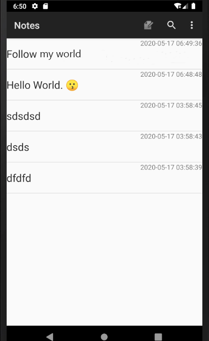
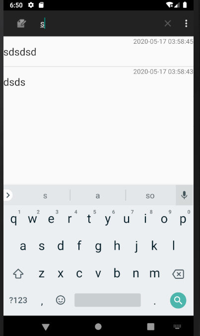
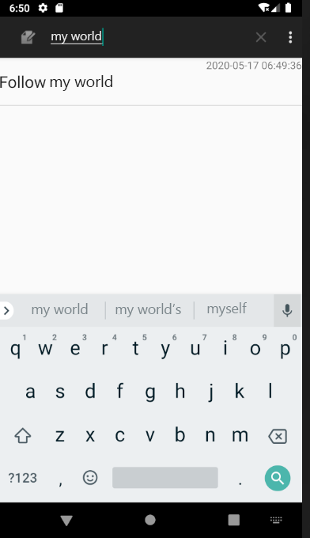
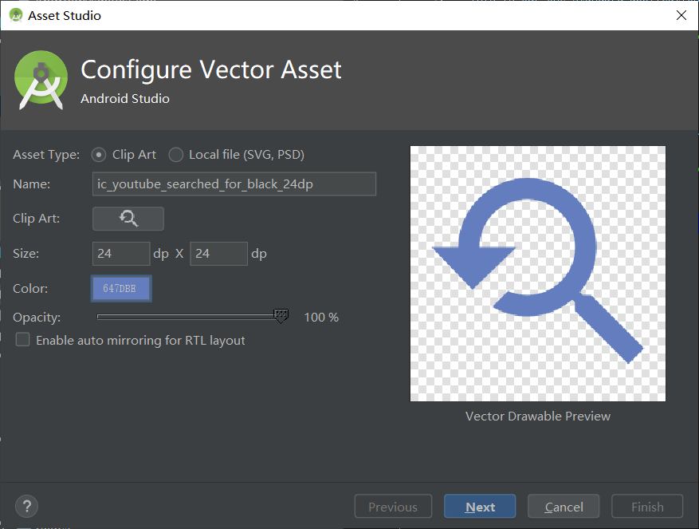
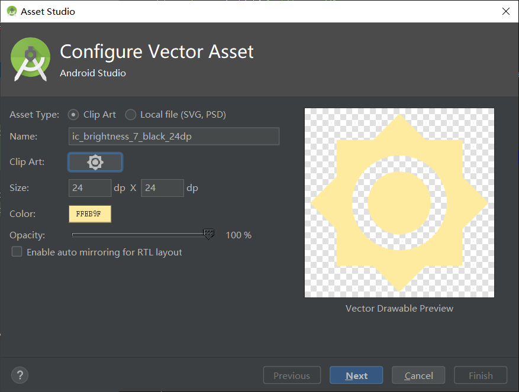

**期中实验：**

功能实现：

**时间戳展示**

**模糊查询**

**匹配唯一**

基于NotePad应用做功能扩展 --时间戳与查询功能  
NotePad源码： https://github.com/llfjfz/NotePad

### 1.时间戳功能实现

#### 在布局文件中增加时间戳

找到布局文件**noteslist_item.xml**，为了显示时间戳，再添加一个TextView用于显示时间戳

\<android.support.constraint.ConstraintLayout
xmlns:android="http://schemas.android.com/apk/res/android"  
android:layout_width="match_parent"  
android:layout_height="match_parent"  
xmlns:app="http://schemas.android.com/apk/res-auto"\>  
\<TextView xmlns:android="http://schemas.android.com/apk/res/android"  
android:id="\@android:id/text1"  
android:layout_width="match_parent"  
android:layout_height="?android:attr/listPreferredItemHeight"  
android:textAppearance="?android:attr/textAppearanceLarge"  
android:gravity="center_vertical"  
android:paddingLeft="5dip"  
android:singleLine="true"  
/\>  
\<TextView  
android:id="\@+id/text2"  
android:layout_width="match_parent"  
android:layout_height="wrap_content"  
android:paddingLeft="5dip"  
android:singleLine="true"  
android:gravity="center_vertical"  
/\>  
\</android.support.constraint.ConstraintLayout\>

1.  **在Android Studio中，依次点击“File”--“New”--“Vector
    Assets”，即可打开“Vector Asset Studio”工具，**

新建图标：

#### 3.编辑 list_options_menu.xml

\<item android:id="\@+id/menu_search"  
android:icon="\@drawable/ic_youtube_searched_for_black_24dp"  
android:title="\@string/search"  
android:showAsAction="always"  
android:actionViewClass="android.widget.SearchView"/\>  
\<!-- If there is currently data in the clipboard, this adds a PASTE menu item
to the menu  
so that the user can paste in the data.. --\>  
\<item android:id="\@+id/menu_setting"  
android:icon="\@drawable/ic_settings_black_24dp"  
android:title="\@string/setting"  
/\>

如下两句结合使用，可以使图标保持显示，而不会被折叠（collapse）。

android:showAsAction="always"  
android:icon="\@drawable/ic_youtube_searched_for_black_24dp"

为menu item添加一个SearchView的widget。

android:actionViewClass="android.widget.SearchView"

### JAVA 文件

### 1.NotePadProvider

修改默认的时间函数格式, Ctrl+F搜索 函数Date

//系统默认显示的时间使用毫秒数进行表示，很难阅读  
Long now = Long.*valueOf*(System.*currentTimeMillis*())**;**  
Date date = new Date(now)**;**  
//将时间格式化为常见的年月日表示形式  
SimpleDateFormat simpleDateFormat = new SimpleDateFormat("yy-MM-dd
HH:mm:ss")**;**  
simpleDateFormat.setTimeZone(TimeZone.getTimeZone("GMT+08:00"))**;**  
String dateFormat = simpleDateFormat.format(date)**;**  
if (values.containsKey(NotePad.Notes.*COLUMN_NAME_CREATE_DATE*) == false) {  
values.put(NotePad.Notes.*COLUMN_NAME_CREATE_DATE***,** dateFormat)**;**  
}  
if (values.containsKey(NotePad.Notes.*COLUMN_NAME_MODIFICATION_DATE*) == false)
{  
values.put(NotePad.Notes.*COLUMN_NAME_MODIFICATION_DATE***,** dateFormat)**;**  
}

在创建表的时候，需要把创建时间和修改时间的属性改为TEXT类型。

*/\*\**  
*\**  
*\* Creates the underlying database with table name and column names taken from
the*  
*\* NotePad class.*  
*\*/*  
\@Override  
public void onCreate(SQLiteDatabase db) {  
db.execSQL("CREATE TABLE " + NotePad.Notes.*TABLE_NAME* + " ("  
+ NotePad.Notes.*\_ID* + " INTEGER PRIMARY KEY,"  
+ NotePad.Notes.*COLUMN_NAME_TITLE* + " TEXT,"  
+ NotePad.Notes.*COLUMN_NAME_NOTE* + " TEXT,"  
+ NotePad.Notes.*COLUMN_NAME_CREATE_DATE* + " TEXT,"  
+ NotePad.Notes.*COLUMN_NAME_MODIFICATION_DATE* + " TEXT"  
+ ");")**;**  
}

#### 2. NoteEditor

业务背景:
有时间戳，那一定是新建笔记/修改笔记，提交之后才能生成，数据才会转交到数据库。

在编辑笔记的类中，需要修改updateNote方法，把时间字符串传入（put）ContentValues里面，再由ContentResolver通过uri把values交给数据库。

private final void updateNote(String text**,** String title) {  
  
// Sets up a map to contain values to be updated in the provider.  
ContentValues values = new ContentValues()**;**  
values.put(NotePad.Notes.*COLUMN_NAME_MODIFICATION_DATE***,**
this.reformatCurrentDate())**;**

getContentResolver().update(  
mUri**,** // The URI for the record to update.  
values**,** // The map of column names and new values to apply to them.  
null**,** // No selection criteria are used, so no where columns are necessary.  
null // No where columns are used, so no where arguments are necessary.  
)**;**

#### 3. NoteList

主界面,在这个类中设置这么几个公有的变量。

SearchView mSearchView; //用于搜索功能

Cursor searchCursor; //用于搜索功能的查询

SimpleCursorAdapter adapter; //用于绑定数据

为了Cursor类能够找到数据库需要映射（projection）的modification_date，需要在PROJECTION中增加一个数据。

*/\*\**  
*\* The columns needed by the cursor adapter*  
*\*/*  
private static final String[] *PROJECTION* = new String[] {  
NotePad.Notes.*\_ID***,** // 0  
NotePad.Notes.*COLUMN_NAME_TITLE***,** // 1  
NotePad.Notes.*COLUMN_NAME_MODIFICATION_DATE*  
}**;**

结合使用managedQuery()方法，就可以获得查找的索引。

Cursor cursor = managedQuery(  
getIntent().getData()**,** // Use the default content URI for the provider.  
*PROJECTION***,** // Return the note ID and title for each note.  
null**,** // No where clause, return all records.  
null**,** // No where clause, therefore no where column values.  
NotePad.Notes.*DEFAULT_SORT_ORDER* // Use the default sort order.  
)**;**

为了列表可以显示数据，设置SimpleCursorAdapter。

dataColumns是src, viewIDs是des。

// The names of the cursor columns to display in the view, initialized to the
title column  
String[] dataColumns = { NotePad.Notes.*COLUMN_NAME_TITLE***,**
NotePad.Notes.*COLUMN_NAME_MODIFICATION_DATE*} **;**  
// The view IDs that will display the cursor columns, initialized to the
TextView in  
// noteslist_item.xml  
int[] viewIDs = { android.R.id.*text1***,** R.id.text3}**;**

可以完整的显示时间戳了。

搜索功能的实现

在onCreateOptionsMenu中自定义initSearch方法，并传入menu。

用getActionView方法找到之前定义过actionViewClass的item，并设置监听事件。

onQueryTextSubmit是用户点击提交的时候查询；onQueryTextChange是只要输入有变化就能够查询。

实现onQueryTextChange，不用点击查询，部分字符匹配就可以查询到。

为用户输入的newText重新定义selection，通过ContentResolver代理查询，并返回一个新的cursor。

把新的cursor交给adapter，再通知adapter数据改变了，重新显示信息。

public void initSearch(Menu menu){  
//menu item - search  
MenuItem mSearch = menu.findItem(R.id.*menu_search*)**;**  
//get action view class  
mSearchView = (SearchView) mSearch.getActionView()**;**  
mSearchView.setQueryHint("search ...")**;**  
mSearchView.setOnQueryTextListener(new SearchView.OnQueryTextListener() {  
\@Override  
public boolean onQueryTextSubmit(String query) {  
return false**;**  
}  
  
\@Override  
public boolean onQueryTextChange(String newText) {  
if(!newText.isEmpty()){  
String selection = NotePad.Notes.*COLUMN_NAME_TITLE*+" GLOB
'\*"+newText+"\*'"**;**  
searchCursor = getContentResolver().query(  
getIntent().getData()**,**  
*PROJECTION***,**  
selection**,**  
null**,**  
NotePad.Notes.*DEFAULT_SORT_ORDER*  
)**;**  
}  
  
//*TODO*  
adapter.swapCursor(searchCursor)**;**  
adapter.notifyDataSetChanged()**;**  
return false**;**  
}  
})**;**  
}
